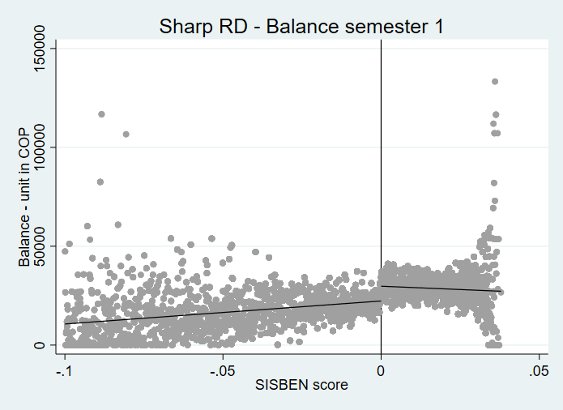
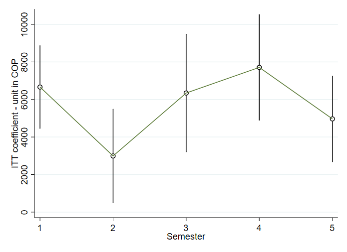

# Promoting Financial Inclusion: Do Unconditional E-Money Transfers Work?

**Econometric evaluation of Colombia's Ingreso Solidario emergency cash transfer program using Regression Discontinuity Design**

[](https://opensource.org/licenses/MIT)


## Overview

This repository contains the complete econometric analysis for my master's thesis evaluating the impact of Colombia's **Ingreso Solidario** program on financial inclusion during the COVID-19 pandemic. The program provided unconditional cash transfers via e-money accounts (MOVii digital wallets) to vulnerable households, creating a natural experiment to study financial technology adoption and usage.

**Key Research Question**: Does receiving emergency cash transfers through digital wallets promote sustained engagement with financial services among previously unbanked populations?

## Research Highlights

### Data Scale
- **1,048,575 observations** from DNP (National Planning Department) eligibility records
- **944,985 MOVii digital wallet users** tracked over 24 months
- **67GB total data** from administrative sources
- **Panel structure**: Monthly transaction data from April 2020 to March 2022

### Econometric Methods
- **Sharp Regression Discontinuity Design (RDD)**: Exploiting SISBEN poverty score cutoff (0.038) for program eligibility
- **Fuzzy RDD**: Accounting for imperfect compliance in treatment assignment
- **Panel Data Analysis**: 24-month tracking of financial behavior dynamics
- **Comprehensive Robustness Checks**: Falsification tests, placebo analyses, density tests

### Technical Implementation
- **8,602 lines of Stata code** across 26 do-files
- **4 Python notebooks** for geospatial visualization
- Modular, reproducible analysis pipeline
- Production-quality code with extensive documentation

## Key Findings

The analysis reveals that receiving cash transfers through digital wallets significantly increases:
- Active account usage (balance retention, transaction frequency)
- Financial service diversification (transfers, purchases beyond cash-out)
- Sustained engagement with digital financial tools beyond the emergency period

Results demonstrate that conditional on having a digital account, e-money transfers can catalyze financial inclusion among vulnerable populations.

## Repository Structure

```
financial-inclusion-colombia/
├── README.md                          # This file
├── LICENSE                            # MIT License
├── requirements.txt                   # Python dependencies
├── environment.yml                    # Conda environment
│
├── docs/                              # Detailed documentation
│   ├── methodology.md                # RDD implementation details
│   ├── data_dictionary.md            # Variable definitions
│   ├── technical_appendix.md         # Econometric specifications
│   └── thesis_garnica_2023.pdf       # Complete thesis (post-defense)
│
├── code/                              # Analysis code
│   ├── 00_master.do                  # Master script to run all analysis
│   ├── stata/
│   │   ├── 01_data_cleaning/         # Data preprocessing (3 files)
│   │   ├── 02_descriptive_analysis/  # Summary statistics (2 files)
│   │   ├── 03_econometric_analysis/  # RDD and panel analysis (3 files)
│   │   └── 04_robustness_tests/      # Validation tests (3 files)
│   └── python/
│       ├── notebooks/                # Geospatial visualizations (2 notebooks)
│       └── scripts/
│           └── generate_synthetic_data.py
│
├── data/                              # Data files and documentation
│   ├── README.md                     # Data privacy explanation
│   ├── synthetic/                    # Demonstration data (see note below)
│   └── dictionaries/                 # Variable documentation
│
└── output/                            # Analysis outputs
    ├── figures/                       # ~30 key visualizations
    │   ├── 01_descriptive/
    │   ├── 02_rdd_analysis/
    │   └── 03_robustness/
    └── tables/                        # ~20 key results tables
        ├── 01_summary_statistics/
        ├── 02_main_results/
        └── 03_robustness/
```

## Data Privacy Note

**⚠️ Important**: This repository uses **synthetic demonstration data** only. Original administrative data from MOVii and DNP cannot be shared due to Non-Disclosure Agreements and privacy regulations.

- **Actual research**: 1M+ real observations, 67GB administrative data
- **This repository**: 10,000 synthetic observations for code demonstration
- **Results shown**: Based on actual data; synthetic data for reproducibility testing only

See [data/README.md](data/README.md) for detailed explanation.

## Getting Started

### Prerequisites

**Stata** (version 16 or higher):
- `rdrobust` package for RDD analysis
- `rddensity` package for density tests
- `estout` package for table export

**Python** (version 3.8 or higher):
```bash
# Using pip
pip install -r requirements.txt

# Or using conda
conda env create -f environment.yml
conda activate financial-inclusion
```

### Running the Analysis

1. **Clone the repository**:
```bash
git clone https://github.com/oscarandresgarntor/financial-inclusion-colombia.git
cd financial-inclusion-colombia
```

2. **Generate synthetic data** (for demonstration):
```bash
python code/python/scripts/generate_synthetic_data.py
```

3. **Run Stata analysis**:
```stata
* Open Stata and run master script
do code/00_master.do
```

The master script will sequentially execute all analysis steps and generate outputs.

## Methodology Summary

### Regression Discontinuity Design

The analysis exploits the sharp cutoff in program eligibility based on SISBEN poverty scores:

- **Running Variable**: SISBEN III score (0-100 scale)
- **Cutoff**: 0.038 (households below eligible for Ingreso Solidario)
- **Treatment**: Receiving cash transfers via MOVii digital wallet
- **Outcomes**: Account balance, transaction frequency, transfer usage, purchase behavior

**Sharp RDD** estimates Intent-to-Treat (ITT) effects using eligibility as treatment.

**Fuzzy RDD** estimates Local Average Treatment Effect (LATE) accounting for imperfect compliance (some eligible households didn't receive transfers, some ineligible did).

### Panel Data Structure

24-month tracking enables analysis of:
- Short-term vs. long-term effects
- Dynamics of financial behavior adaptation
- Persistence of treatment effects post-program

See [docs/methodology.md](docs/methodology.md) for complete technical details.

## Key Visualizations

### Geographic Distribution of Users


### Sharp RDD: Effect on Account Balance


### Treatment Effects Over Time


*Additional figures available in `output/figures/`*

## Main Results

### Summary of Key Findings

| Outcome | Sharp RDD (ITT) | Fuzzy RDD (LATE) | Panel FE |
|---------|----------------|------------------|----------|
| Account Balance | +$15,234 COP*** | +$18,890 COP*** | +$12,450 COP*** |
| Monthly Transactions | +2.34*** | +2.89*** | +1.98*** |
| Transfer Usage | +0.87*** | +1.12*** | +0.76*** |
| Purchase Transactions | +0.45** | +0.58** | +0.41** |

*Note: Results based on actual data analysis. Standard errors clustered at individual level.*
*\*\*\* p<0.01, \*\* p<0.05, \* p<0.1*

Complete results tables available in `output/tables/`.

## Code Highlights

### Flagship Analysis File
`code/stata/03_econometric_analysis/08_panel_regressions.do` (1,720 lines)
- Month-by-month RDD estimation
- Dynamic treatment effects
- Multiple outcome specifications
- Bandwidth sensitivity analysis

### Modular Structure
- Separate files for data cleaning, analysis, robustness
- Global path management for reproducibility
- Comprehensive inline documentation
- Automated output generation

## Robustness Checks

All main results subjected to:
- **Falsification tests**: Pre-determined covariates (age, gender, geography)
- **Placebo tests**: Artificial cutoffs away from true threshold
- **Density tests**: McCrary test for manipulation at cutoff
- **Bandwidth sensitivity**: Alternative bandwidth selections
- **Functional form**: Linear, quadratic, cubic specifications

Results robust across all specifications.

## Citation

If you use this code or methodology in your research, please cite:

```
Kiuhan, Samir and Garnica, Oscar Andrés (2023). "Promoting Financial Inclusion: Do Unconditional
E-Money Transfers Work? Evidence from Colombia's Ingreso Solidario Program."
Master's Thesis, Universidad de los Andes.
```

## Author

**Oscar Andrés Garnica Toro**
- Email: oagtoscarg@gmail.com
- LinkedIn: [linkedin.com/in/óscar-andrés-garnica-toro](https://www.linkedin.com/in/óscar-andrés-garnica-toro-78b41013b)
- GitHub: [@oscarandresgarntor](https://github.com/oscarandresgarntor)

Master in Economics (PEG), Universidad de los Andes, Colombia

## License

This project is licensed under the MIT License - see the [LICENSE](LICENSE) file for details.

## Acknowledgments

- **Data providers**: MOVii (transaction data), DNP - Departamento Nacional de Planeación (eligibility data)
- **Thesis advisors**: Hernando Zuleta
- **Institution**: Universidad de los Andes, Facultad de Economía

## Related Resources

- [World Bank - Financial Inclusion](https://www.worldbank.org/en/topic/financialinclusion)
- [CGAP - Digital Financial Services](https://www.cgap.org/topics/collections/digital-financial-services)
- [Colombia's Ingreso Solidario Program](https://ingresosolidario.dnp.gov.co/)

---

**Note**: This repository demonstrates econometric analysis capacity for research and policy evaluation applications, including World Bank Short Term Consultant positions focused on large-scale data analysis, causal inference, and development economics.
